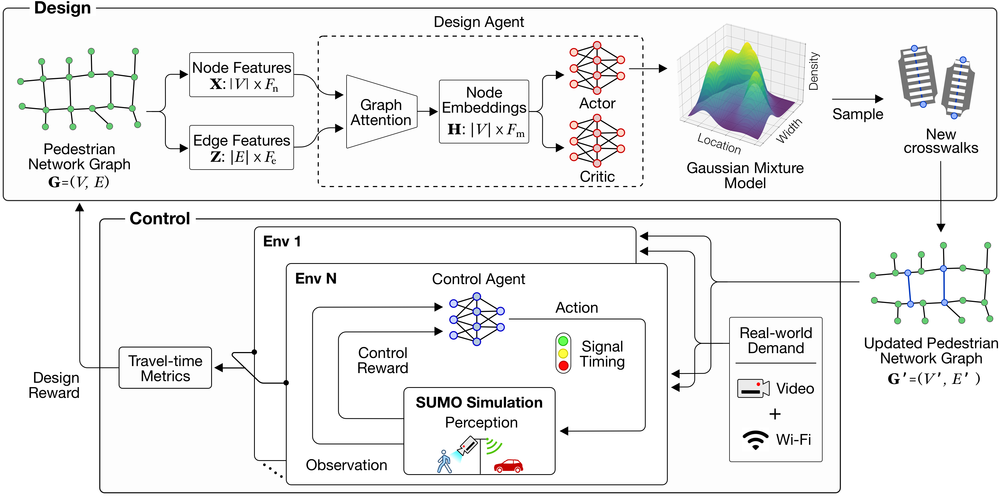
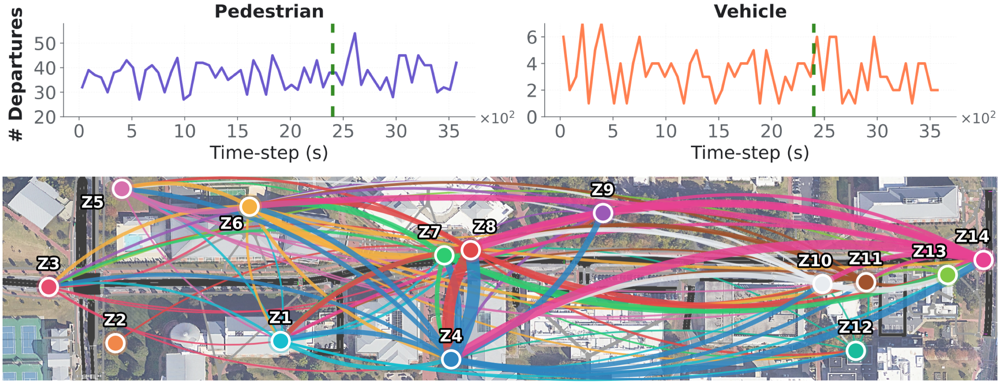

## DeCoR: Design and Control Co-Optimization for Urban Streets Using Reinforcement Learning

<a href="https://arxiv.org/pdf/2605.21311"></a> <a href="https://www.youtube.com/watch?v=fmLydgvk2p4"></a>
[](https://github.com/poudel-bibek/DeCoR/releases)

<p align="center">
  
</p>

### 📌 Overview

DeCoR is a two-stage reinforcement learning framework for co-optimizing mid-block crosswalk placement and adaptive traffic signal control. It uses pedestrian and vehicle flow observations to generate crosswalk layouts, evaluate them in closed-loop traffic simulation, and learn signal timings that reduce delay for both pedestrians and vehicles.

<p align="center">
  
  <br>
  <em>
  Overview of DeCoR. A design agent proposes mid-block crosswalk layouts, while a control agent learns adaptive signal timings for each layout through closed-loop traffic simulation with pedestrian and vehicle demand.
  </em>
</p>

---
### 📊 Data

The default corridor and demand inputs are stored in `simulation/` as SUMO-compatible files.

| Input | Location | Description |
| --- | --- | --- |
| Corridor network | `simulation/Craver_traffic_lights_wide.net.xml` | SUMO network for the Craver Road study corridor. |
| Pedestrian demand | `simulation/original_pedtrips.xml` | `2,221` pedestrian `<person>` / `<walk>` records over roughly one hour, with `14` TAZ labels and `24` origin/destination edges. |
| Vehicle demand | `simulation/original_vehtrips.xml` | `200` vehicle `<trip>` records over roughly one hour, balanced between TAZ `1 -> 7` and `7 -> 1` with one default vehicle type. |

The demand XML files encode origin-destination demand, not fully routed paths; realized routes depend on the SUMO network and routing configuration.

<p align="center">
  
  <br>
  <em>
  Observed pedestrian and vehicle departures, train/evaluation split, and pedestrian OD flows across the 14-zone corridor; 69.6% of pedestrian trips require crossing the corridor.
  </em>
</p>

---
### 📦 Checkpoints and Results

| Artifact | Location | Notes |
| --- | --- | --- |
| Pretrained policy | `runs/readout_32/May09_11-34-05/saved_policies/policy_at_7603200.pth` | Checkpoint used by the default `eval_model_path`. |
| Paper evaluation JSONs | `runs/readout_32/May09_11-34-05/results/eval_May10_16-16-52/` | Includes DeCoR control, fixed-time, unsignalized, and real-world unsignalized evaluation outputs. |
| Design baseline JSON | `runs/baselines_experiment/baseline_results.json` | Stored uniform/random design baseline results used by plotting utilities. |

---
### ⚙️ Setup

- Install Eclipse SUMO 1.21 or [SUMO 1.22.0](https://github.com/eclipse-sumo/sumo/releases/tag/v1_22_0). Make sure `sumo`, `sumo-gui`, and `netconvert` are available on your `PATH`.
- Verify SUMO:
  ```bash
  sumo --version
  ```
- Install Python 3.12 and [uv](https://docs.astral.sh/uv/). Python dependencies are defined in `pyproject.toml` and locked in `uv.lock`; `sumolib` and `traci` are pinned to `1.22.0`.
- Sync the project environment:
  ```bash
  uv sync
  ```

---
### 🚀 Training

For training, set these values in `config.py`:

```python
"evaluate": False,
"gui": False,
```

Then run:

```bash
uv run python main.py
```

Training writes a timestamped run folder under `runs/<timestamp>/`, including `config.json`, TensorBoard logs, generated SUMO networks, and policies under `saved_policies/`. If `eval_freq > 0`, training also writes intermediate evaluation JSONs under `runs/<timestamp>/results/train_<timestamp>/`.

To monitor TensorBoard:

```bash
uv run tensorboard --logdir runs
```

### 🧠 Trained Design Policy

<p align="center">
  
  <br>
  <em>
  The design agent learns a Gaussian mixture over crosswalk location and width, where density peaks correspond to selected mid-block crosswalk proposals.
  </em>
</p>

---
### 📈 Evaluation

Set `evaluate=True` in `config.py` and point `eval_model_path` to a saved checkpoint:

```python
"evaluate": True,
"eval_model_path": "runs/<run_name>/saved_policies/<checkpoint>.pth",
```

Then run:

```bash
uv run python main.py
```

The active evaluation path in `main.py` evaluates the trained DeCoR policy over the configured demand scales and writes:

```text
runs/<run_name>/results/eval_<timestamp>/<checkpoint>_ppo.json
```

Paper comparison results are included under `runs/readout_32/May09_11-34-05/results/eval_May10_16-16-52/` for real-world unsignalized, DeCoR unsignalized, DeCoR fixed-time, and DeCoR control settings.

### 📝 Code Structure

```text
├── main.py                  # Training and evaluation entry point
├── config.py                # Runtime configuration and argument grouping
├── utils.py                 # Policy IO, demand scaling, result aggregation
├── pyproject.toml           # uv project metadata and direct dependencies
├── uv.lock                  # Locked dependency resolution
├── images/                  # Tracked README and corridor visual assets
├── plots/
│   ├── training_plots.py    # Training-era control/design plots and videos
│   ├── result_plots.py      # Paper result figures and combined plots
│   └── pedestrian_flow_plot.py
│                            # Standalone pedestrian flow allocation figure
├── ppo/
│   ├── models.py            # Lower MLP policy and higher GAT/GMM policy
│   ├── ppo.py               # PPO update implementation
│   └── ppo_utils.py         # Memory, normalizers, graph batching helpers
├── simulation/
│   ├── Craver_traffic_lights_wide.net.xml
│   ├── original_vehtrips.xml
│   ├── original_pedtrips.xml
│   ├── design_env.py        # Higher-level crosswalk design environment
│   ├── control_env.py       # Lower-level TraCI/SUMO control environment
│   ├── worker.py            # Parallel training/evaluation workers
│   ├── sim_setup.py         # Phase definitions and lane/crosswalk metadata
│   └── env_utils.py         # SUMO config, graph, and geometry helpers
└── runs/
    └── readout_32/...       # Included checkpoint and paper result artifacts
```

---
### 🔧 Important Configuration Values

| Key | Default | Notes |
| --- | ---: | --- |
| `evaluate` | `True` | Set to `False` for training. |
| `gui` | `True` | Set to `False` for faster headless SUMO runs. |
| `gpu` | `True` | Uses CUDA when available; falls back to CPU otherwise. |
| `total_timesteps` | `15000000` | Total lower-level simulation timesteps for training. |
| `lower_num_processes` | `10` | Parallel lower-level training workers. Adjust to your CPU. |
| `lower_max_timesteps` | `360` | Episode horizon, excluding warmup. |
| `lower_step_length` | `1.0` | SUMO seconds per simulation step. |
| `lower_action_duration` | `10` | Simulation steps per control action. |
| `lower_warmup_steps` | `[40, 140]` | Randomized warmup before policy control. |
| `demand_scale_min/max` | `1.0 / 2.25` | Training demand scale range. |
| `eval_lower_timesteps` | `450` | Evaluation episode horizon, excluding warmup. |
| `eval_lower_workers` | `10` | Parallel evaluation workers. |
| `eval_worker_device` | `"gpu"` | Evaluation policy device preference. |
| `max_proposals` | `10` | Maximum crosswalk proposals from the design agent. |
| `min_thickness/max_thickness` | `2.0 / 15.0` | Crosswalk width bounds in meters. |
| `num_mixtures` | `7` | GMM components for the design policy. |

---
### ⚠️ Debugging

- Running with `gui=True` is useful for visual checks but substantially slower than headless SUMO.
- On Linux or WSL, if multiprocessing fails because too many files are open, increase the file descriptor limit before training:
  ```bash
  ulimit -n 20000
  ```
- If a run fails, check `netconvert_log.txt`, `sumo_logfile.txt`, and `sumo_errorlog.txt` in the relevant `runs/` subfolder.

---
### 📖 Citation

If you find this work useful in your own research:

```bibtex
@misc{poudel2026decor,
  title = {DeCoR: Design and Control Co-Optimization for Urban Streets Using Reinforcement Learning},
  author = {Poudel, Bibek and Zhu, Lei and Heaslip, Kevin and Swaminathan, Sai and Li, Weizi},
  year = {2026},
  eprint = {2605.21311},
  archivePrefix = {arXiv},
  note = {Preprint}
}
```

---
### 🙏 Acknowledgements

We thank Jakob Erdmann ([@namdre](https://github.com/namdre)) of SUMO for helping with technical issues in simulation.
