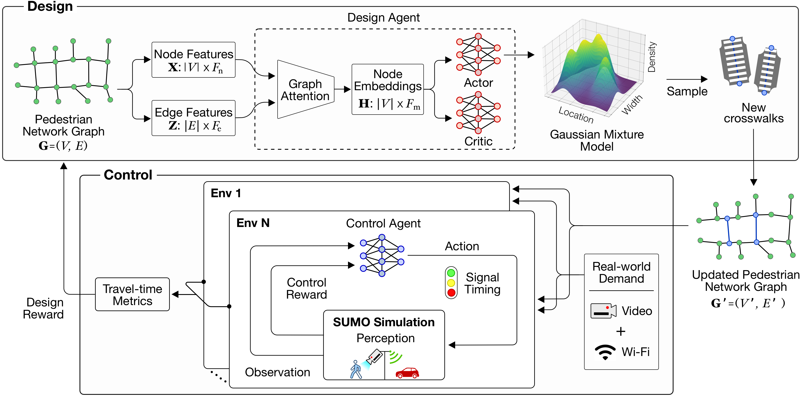
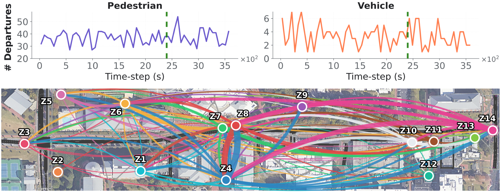

## DeCoR: Design and Control Co-Optimization for Urban Streets Using Reinforcement Learning

<a href="https://arxiv.org/pdf/2605.21311"></a> <a href="https://www.youtube.com/watch?v=fmLydgvk2p4"></a>
[](https://github.com/poudel-bibek/DeCoR/releases)

<p align="center">
  
</p>

### 📌 Overview

DeCoR is a two-stage reinforcement learning framework for co-optimizing mid-block crosswalk placement and adaptive traffic signal control. It uses pedestrian and vehicle flow observations to generate crosswalk layouts, evaluate them in closed-loop traffic simulation, and learn signal timings that reduce delay for both pedestrians and vehicles.

<p align="center">
  
  <br>
  <em>
  Overview of DeCoR. A design agent proposes mid-block crosswalk layouts, while a control agent learns adaptive signal timings for each layout through closed-loop traffic simulation with pedestrian and vehicle demand.
  </em>
</p>

---
### 📊 Data

The default corridor and demand inputs are stored in `simulation/` as SUMO-compatible files.

| Input | Location | Description |
| --- | --- | --- |
| Corridor network | `simulation/Craver_traffic_lights_wide.net.xml` | SUMO network for the Craver Road study corridor. |
| Pedestrian demand | `simulation/original_pedtrips.xml` | `2,221` pedestrian `<person>` / `<walk>` records over roughly one hour, with `14` TAZ labels and `24` origin/destination edges. |
| Vehicle demand | `simulation/original_vehtrips.xml` | `200` vehicle `<trip>` records over roughly one hour, balanced between TAZ `1 -> 7` and `7 -> 1` with one default vehicle type. |

The demand XML files encode origin-destination demand, not fully routed paths; realized routes depend on the SUMO network and routing configuration.

<p align="center">
  
  <br>
  <em>
  Observed pedestrian and vehicle departures, train/evaluation split, and pedestrian OD flows across the 14-zone corridor; 69.6% of pedestrian trips require crossing the corridor.
  </em>
</p>

---
### 📦 Checkpoints and Results

| Artifact | Location | Notes |
| --- | --- | --- |
| Fresh controller checkpoints | `runs/<study>/<learner_seed>/<layout>/` | Local catalogue-training outputs; checkpoints and run evidence are not bundled with the source repository. |
| Catalogue diagnostics | `runs/<study>/catalogue_diagnostic.json` | Local full-cohort results and provenance, with raw per-trial evidence retained alongside them. |

The historical May 2025 checkpoint and evaluation JSONs have been removed from this checkout. Historical plotting defaults and `config.py`'s legacy `eval_model_path` still name those inputs; supply compatible local artifacts explicitly rather than treating those paths as bundled data. The fixed-catalogue workflow below does not depend on them.

---
### ⚙️ Setup

- Install Python 3.12 and [uv](https://docs.astral.sh/uv/). `pyproject.toml` and `uv.lock` pin Eclipse SUMO, `sumolib`, and `traci` to `1.27.1`.
- Sync the project environment, including the SUMO binaries:
  ```bash
  uv sync --frozen
  ```
- Verify the project runtime and converter:
  ```bash
  uv run --frozen sumo --version
  uv run --frozen netconvert --version
  ```
- The environments use the binaries bundled with the installed `eclipse-sumo` package, not an unrelated system `SUMO_HOME` or `PATH` installation. `gui=True` uses its `sumo-gui` binary and requires a working graphical display.
- Historical runs retain their recorded source and simulator versions. The new builder preserves curved road/sidewalk geometry and source sidewalk widths, and the intersection uses conflict-compatible protected greens. Do not reinterpret earlier results as validation of this revised geometry and signal behavior.
- A copied `.venv` can retain interpreter paths from the previous machine. Recreate it from `uv.lock` on the destination, and derive destination-local catalogue inputs with verified network hashes; do not rewrite archived manifests or source snapshots to repair old absolute paths.

---
### 🚀 Training

For training, set these values in `config.py`:

```python
"evaluate": False,
"gui": False,
```

Then run:

```bash
uv run python main.py
```

Training writes a timestamped run folder under `runs/<timestamp>/`, including `config.json`, TensorBoard logs, generated SUMO networks, and policies under `saved_policies/`. If `eval_freq > 0`, training also writes intermediate evaluation JSONs under `runs/<timestamp>/results/train_<timestamp>/`.

The design policy proposes a complete layout from the original-crossing reset graph on every round and uses that same context for final layout extraction. New configurations use `higher_gamma = 0` for immediate normalized design rewards; the controller retains its temporal PPO objective. Historical runs and their recorded configurations are unchanged.

Controller updates report sampled and exact KL divergence, clipping fraction, maximum absolute log ratio, and pre-update likelihood agreement over the complete collected rollout, respecting each transition's sparse action mask. `lower_approx_kl` no longer describes only the final minibatch. These diagnostics are recorded by both training entrypoints; the standard entrypoint also sends them to TensorBoard or Weights & Biases.

New controllers retain the hidden layers' random biases and initialize the actor output weights with gain `0.01`. This avoids amplified cold-start responses to zero-normalized observations through stacked LayerNorm and starts action probabilities near uniform. Only fresh initialization changes: the architecture, observation version 3, and predictions from loaded saved weights remain unchanged. Record new initial policy hashes when restarting a study.

The controller defaults are LR `1e-4`, two PPO epochs, and batch size `1080`, matching three complete ten-worker rounds of 36 decisions. These settings reduce policy change in an identical-batch training diagnostic; they are not evidence of convergence or better traffic performance. Validate new studies with full-rollout controller and design gates, preserve failed attempts, and keep tuning separate from held-out evaluation.

Rendered run diagnostics go under `runs/<timestamp>/generated/graph_iterations/` and `generated/gmm_iterations/`. Their serialized graph/GMM source data remain in the run's original `graph_iterations/` and `gmm_iterations/` directories.

To monitor TensorBoard:

```bash
uv run tensorboard --logdir runs
```

### 🧠 Trained Design Policy

<p align="center">
  
  <br>
  <em>
  The design agent learns a Gaussian mixture over crosswalk location and width, where density peaks correspond to selected mid-block crosswalk proposals.
  </em>
</p>

---
### 📈 Evaluation

Set `evaluate=True` in `config.py` and point `eval_model_path` to a saved checkpoint:

```python
"evaluate": True,
"eval_model_path": "runs/<run_name>/saved_policies/<checkpoint>.pth",
```

Then run:

```bash
uv run python main.py
```

The active evaluation path in `main.py` evaluates the trained DeCoR policy over the configured demand scales and writes:

```text
runs/<run_name>/results/eval_<timestamp>/<checkpoint>_ppo.json
```

Historical paper comparisons used the May 2025 run. Those evaluation files are no longer included; use explicitly retained historical inputs only for historical plots, not as evidence for the current implementation.

#### Placement-matched baselines

Prepare from a completed, non-development `training.json` with the current design readout (version 2). Keep the parent study's `study.json` and `source_snapshot/`, plus the recorded checkpoint and final network, available. Replace the example paths below; the destination must be fresh.

```bash
uv run python review_validation.py prepare runs/matched_baselines/14100 \
    --training-artifact runs/completed_study/14100/joint/training.json
uv run python review_validation.py search runs/matched_baselines/14100
uv run python review_validation.py matrix runs/matched_baselines/14100
```

This path uses common actuated control for the original, recorded final, Uniform, and best-of-20 random layouts. Only placement varies: crossing count and west-to-east widths match the recorded final layout. `search` runs all 120 training-window selection trials (20 candidates, two scales, three seeds), retains failures, and freezes selection before `matrix` evaluates the study's declared held-out demand. Training provenance is preserved separately from the frozen evaluator sources and inputs. These rows are separate from learned-policy evaluation and random-layout controller training.

#### Bounded operational-feedback comparison

`review_validation.py` also compares an explicit placement grid under tuned fixed-time and common actuated control, without historical checkpoints or policy training. Candidate layouts must have the same crossing count and west-to-east normalized widths; normalized locations must be ordered, within `[0.01, 0.99]`, and at least `0.08` apart. Physical proposals and generated networks are recorded in the manifest.

Declare a JSON protocol before running. This small example is an execution smoke, not a research-scale protocol or a scientifically justified one-second practical margin:

```json
{
  "placements": [[[0.25, 0.5], [0.75, 0.5]], [[0.35, 0.5], [0.65, 0.5]]],
  "selection_scales": [0.25],
  "evaluation_scales": [0.25],
  "selection_seeds": [70101, 70102],
  "evaluation_seeds": [70111, 70112],
  "timings": [[15, 10], [30, 20]],
  "practical_margin_s": 1.0
}
```

Save it as `protocol.json`, then use a fresh output directory:

```bash
uv run --frozen python review_validation.py feedback-prepare runs/feedback_comparison --protocol protocol.json
uv run --frozen python review_validation.py feedback-select runs/feedback_comparison
uv run --frozen python review_validation.py feedback-evaluate runs/feedback_comparison
```

Each timing pair specifies intersection and mid-block vehicle-green durations in seconds. For each placement, fixed-time tuning minimizes **mean pedestrian complete journey time plus mean vehicle time loss and insertion delay**, equally weighting the two class means. All rules share those tuned parameters and candidate trials. The three layout-ranking scores use first-approach age, first-approach age plus stopped time on crossing approaches, and those two terms plus vehicle delay. These are score ablations, not procedures wholly isolated from operational information: tuning uses journey outcomes, simulated approach age can depend on control, and the approach cohort can differ by layout.

Selection uniformly averages per-trial scores over the declared scale-by-seed grid; it does not pool travelers across trials.

Trials use 100 s fixed-control warmup, 450 s measurement, then at most 1800 s continued service without later departures. The complete cohort includes warmup trips; journey time begins at scheduled departure. A candidate timing must complete every selection cohort without teleports or collisions other than pedestrian–pedestrian overlaps. Those overlaps remain reported diagnostics, not score vetoes. Missing approach observations are undefined, not zero; failures remain in `feedback_selection.json`, and no eligible choice blocks evaluation rather than manufacturing a winner.

Selection uses the original recording's `[0, 2400)` window; evaluation uses `[2400, 3600)` with distinct declared seeds. That evaluation window has already been inspected in earlier studies: this is within-recording exploratory/mechanistic evidence, not a fresh dataset. Source/input/network hashes and selection-result hashes guard reuse. `feedback-select` cannot overwrite frozen choices. `feedback_results.json` retains every declared evaluation, simulation accounting, and paired differences in the common journey criterion. Scales are averaged within each evaluation-seed block before computing a conditional Student-t interval across blocks; incomplete pairs are never dropped. Benefit, harm, and practical equivalence use the declared margin and the whole interval. These are per-comparison, not simultaneous, statements conditional on the recording and selected layouts.

Each comparison identifies both selected layouts and flags `identical_selection`. When both rules select the same layout/controller procedure and service is eligible, their contrast is exactly zero by construction. This is not evidence of selection stability or of feedback being unnecessary on other candidate sets.

Each trial retains raw demand, `tripinfo.xml`, simulator logs and `mechanism.jsonl`. Mechanism records cover every warmup, measurement and drain second: signal phases/states, lane membership arrivals, stopped-vehicle counts and distance from the stop line to the farthest stopped vehicle's rear. The latter is a queue-extent proxy, not a verified contiguous queue or a spillback diagnosis; lane membership arrivals include lane changes. Geometry and lane shapes support subsequent mechanism analysis without claiming causal explanations automatically.

#### Fixed-catalogue controller development

`review_training.py` supports fresh controller training on a separately prepared layout catalogue. Each layout receives its own policy and Welford state; layouts sharing a learner seed start from identical controller parameters. The design policy is not updated. Preparation freezes the protocol, classified configuration, sources, demand inputs and exact network/slot identities in `preparation.json`; mutable progress lives in `study.json`.

Use the prepared `layouts.json` and declared `pilot_protocol.json`, with fresh output directories:

```bash
# Freeze inputs without starting learners.
uv run --frozen python review_training.py catalogue-prepare runs/catalogue_prepared \
    --catalogue /path/to/layouts.json --protocol /path/to/pilot_protocol.json

# Separately authorized execution smoke: two layouts, one seed, three ten-worker rounds each.
uv run --frozen python review_training.py catalogue-smoke runs/catalogue_smoke \
    --catalogue /path/to/layouts.json --protocol /path/to/pilot_protocol.json
uv run --frozen python review_validation.py catalogue-calibrate runs/catalogue_smoke
uv run --frozen python review_validation.py catalogue-diagnose runs/catalogue_smoke
```

`catalogue-train` runs the separately authorized pilot, not the smoke. It can consume an unused prepared directory, but cannot retry a running or failed study. Physical validation and exact-source review are prerequisites; preparation or a passing smoke does not authorize the pilot.

A protocol with `"study_type": "learning_rate_screen"` uses the same preparation/training commands for one learner seed, the validated `two_spread` and `six_central` catalogue entries, and one declared learning rate from `1e-4`, `3e-4`, or `1e-3`. Prepare a separate fresh study for each rate; all other training settings and numerical gates remain unchanged. Each study uses ten rollout workers, so account for their combined resource use when running rates concurrently.

For this profile, run `catalogue-diagnose` after training completes; it evaluates only the learned checkpoints and does not require or admit redundant classical calibration. Full screens retain checkpoints 0/48/96; the existing three-round smoke uses 0/3. Ordinary catalogue studies still require classical calibration and include classical comparators. Select a provisional rate using predeclared development performance and eligibility, then verify it with fresh learner seeds; this tuning screen does not answer the paper's infrastructure-selection question.

Learned, coordinated-schedule and local-actuated controllers use the same `shared_v1` executor: yellow, all-red, occupied-crossing/junction clearance and minimum green. A committed service request survives later requests while clearance is pending. Checkpoints retain the executor protocol, sparse slot map and per-head exposure; incompatible executor protocols are rejected before loading weights. Round-zero checkpoints are explicitly diagnostic-only and do not bypass trained-policy exposure checks.

Training records distinguish successfully collected learner steps from confirmed executed steps, warmup and uncollected work. An interrupted simulator call makes execution accounting a lower bound. Failed rounds and original errors remain recorded; the collector tears down only its owned workers, without an optimizer update after collection failure.

Calibration and diagnostics use paired demand, fixed warmup and a full-cohort drain cap. Teleports, serious or unclassified collisions, or unfinished cohorts make the exact primary score unavailable rather than zero. Pedestrian–pedestrian overlaps do not suppress an otherwise valid score. Exact-score availability is distinct from a development continuation decision: an isolated unfinished trip is not an automatic stop; report its count and an explicit journey-time lower bound instead of dropping the scenario or pretending it finished. All outcomes, requested actions, learned action probabilities and executed service traces are retained. Small KL, a checkpoint roundtrip or positive head exposure does not demonstrate controller competence, traffic safety or superiority.

Collision reporting records TraCI collision events, rather than affected vehicle IDs, and adds pedestrian–pedestrian overlaps from SUMO's closed error log because those warnings are not registered in TraCI. Only events explicitly classified as `person-person` receive the diagnostic-only exemption; pedestrian–vehicle, vehicle–vehicle and unclassified collisions remain serious review conditions. Reporting covers warmup, measurement and drainage; the pre-drain snapshot excludes later incidents. Earlier vehicle-only records can undercount collisions. Preserve original records and frozen decisions, and identify later reporting corrections or acceptance-rule revisions separately instead of rewriting history. PPO numerical stop thresholds remain unchanged.

Lower-policy updates additionally report mean pre-clipping actor and critic gradient norms, whole-update actor parameter displacement, and full-rollout entropy divided by the maximum entropy of each transition's active heads. Catalogue gate records retain these measurements without changing the optimizer or clipping rule. They diagnose update scale and policy concentration; they are not convergence or competence criteria.

The optional logger uses one W&B run per study, layout and learner seed, with a compact metric allowlist under `training/`, `ppo/` and `eval/`. Its isolated SDK leaves the scientific environment and authoritative local records unchanged:

```bash
uv run --no-project --with wandb==0.30.0 python wandb_sync.py runs/catalogue_smoke --follow --mode offline
# After stopping the offline process, use the explicitly authorized private destination:
uv run --no-project --with wandb==0.30.0 python wandb_sync.py runs/catalogue_smoke --once --mode online \
    --entity YOUR_ENTITY --project YOUR_PRIVATE_PROJECT
```

Training rounds, PPO updates and evaluation checkpoint rounds have separate horizontal axes. Rewards are recorded only for the round that triggers an actual controller update, not reconstructed over the full multi-round PPO buffer. Evaluation appears only after the entire declared demand-scale/seed block is available. `eval/primary_journey_mean_s` averages the per-block sum of pedestrian journey time and vehicle time loss plus insertion delay; it remains null if any block is ineligible or fails. Completion fractions pool native completed/scheduled counts, and unavailable incident counters remain null rather than zero. Individual calibration and classical-controller trials stay local. Configuration explicitly labels current training as sampled and diagnostic evaluation as greedy. The logger consumes published diagnostics; it does not schedule evaluations or launch training.

The logger verifies private project access before upload and sends selected metrics and provenance hashes, not source files or checkpoints. A versioned event ledger preserves late evaluations without rewriting earlier training events; keep `.wandb_sync/v2/ledgers/` when resuming. Offline and online cursors are separate, and the v2 learner streams do not reuse legacy per-trial runs. Restart this same CLI against the authoritative JSON records; do not upload its staging directories with `wandb sync`. Online acceptance requires server history readback, and a failed readback leaves the cursor unchanged with a visible error. Local training does not depend on the logging service.

### 📝 Code Structure

```text
├── main.py                  # Training and evaluation entry point
├── review_training.py       # Frozen comparison and fixed-catalogue training workflows
├── review_validation.py     # Calibration, full-cohort diagnostics and comparisons
├── wandb_sync.py            # Isolated optional per-learner W&B logger
├── config.py                # Runtime configuration and argument grouping
├── utils.py                 # Policy IO, demand scaling, result aggregation
├── pyproject.toml           # uv project metadata and direct dependencies
├── uv.lock                  # Locked dependency resolution
├── images/                  # Tracked README and corridor visual assets
├── plots/
│   ├── training_plots.py             # Training-era control/design result plots
│   ├── result_plots.py               # Graph, distribution, and flow visualizations
│   ├── design_distribution.py        # Design density and reward ablation
│   ├── corridor_demand.py            # Corridor image and observed demand
│   ├── layout_control_comparison.py  # Historical layout/control evaluation
│   ├── pedestrian_flow_allocation.py # Illustrative pedestrian flow allocation
│   ├── training_transfer_comparison.py # Historical rewards and layout transfer
│   └── generated/                   # Ignored standalone plot outputs
├── ppo/
│   ├── models.py            # Lower MLP policy and higher GAT/GMM policy
│   ├── ppo.py               # PPO update implementation
│   └── ppo_utils.py         # Memory, normalizers, graph batching helpers
├── simulation/
│   ├── Craver_traffic_lights_wide.net.xml
│   ├── original_vehtrips.xml
│   ├── original_pedtrips.xml
│   ├── design_env.py        # Higher-level crosswalk design environment
│   ├── control_env.py       # Lower-level TraCI/SUMO control environment
│   ├── worker.py            # Parallel training/evaluation workers
│   ├── signal_control.py    # Shared clearance executor and classical request policies
│   ├── sim_setup.py         # Phase definitions and lane/crosswalk metadata
│   └── env_utils.py         # SUMO config, graph, and geometry helpers
└── runs/
    └── <study>/             # Local/ignored training, checkpoints and evaluation evidence
```

### Generating plots

Run a descriptive generator without an output argument, for example:

```bash
uv run python plots/design_distribution.py
```

The five descriptive generators write matching PNG filenames under the repository's `plots/generated/` directory, independent of the working directory. An optional output path remains available for an explicit export. Legacy plot helpers also write to `plots/generated/`; animation frames default to `plots/generated/gmm_animation_frames/`. Animation generation refuses a nonempty directory unless `--keep-frames` is explicit, preserving unrelated files.

Generators consume retained experiment data, not new simulation results. Some inputs are local research assets rather than files in a clean checkout, including the annotated corridor image from the paper checkout, ablation records and the illustrative flow cache. Existing paper figure copies are not overwritten by default.

`plots/generated/` and per-run `generated/` directories are ignored by Git.

---
### 🔧 Important Configuration Values

| Key | Default | Notes |
| --- | ---: | --- |
| `evaluate` | `True` | Set to `False` for training. |
| `gui` | `True` | Set to `False` for faster headless SUMO runs. |
| `gpu` | `True` | Uses CUDA when available; falls back to CPU otherwise. |
| `total_timesteps` | `15000000` | Total lower-level simulation timesteps for training. |
| `lower_num_processes` | `10` | Parallel lower-level training workers. Adjust to your CPU. |
| `lower_max_timesteps` | `360` | Episode horizon, excluding warmup. |
| `lower_step_length` | `1.0` | SUMO seconds per simulation step. |
| `lower_action_duration` | `10` | Simulation steps per control action. |
| `lower_warmup_steps` | `[40, 140]` | Randomized warmup before policy control. |
| `demand_scale_min/max` | `1.0 / 2.25` | Training demand scale range. |
| `eval_lower_timesteps` | `450` | Evaluation episode horizon, excluding warmup. |
| `eval_lower_workers` | `10` | Parallel evaluation workers. |
| `eval_worker_device` | `"gpu"` | Evaluation policy device preference. |
| `max_proposals` | `10` | Maximum crosswalk proposals from the design agent. |
| `min_thickness/max_thickness` | `2.0 / 15.0` | Crosswalk width bounds in meters. |
| `num_mixtures` | `7` | GMM components for the design policy. |

---
### ⚠️ Debugging

- Running with `gui=True` is useful for visual checks but substantially slower than headless SUMO.
- On Linux or WSL, if multiprocessing fails because too many files are open, increase the file descriptor limit before training:
  ```bash
  ulimit -n 20000
  ```
- If a run fails, inspect `components/iteration_*.netconvert.log` and `sumo_logfile*.txt` / `sumo_errorlog*.txt` in its `runs/` subfolder. Converter logs are retained separately for each layout.

---
### 📖 Citation

If you find this work useful in your own research:

```bibtex
@misc{poudel2026decor,
  title = {DeCoR: Design and Control Co-Optimization for Urban Streets Using Reinforcement Learning},
  author = {Poudel, Bibek and Zhu, Lei and Heaslip, Kevin and Swaminathan, Sai and Li, Weizi},
  year = {2026},
  eprint = {2605.21311},
  archivePrefix = {arXiv},
  note = {Preprint}
}
```

---
### 🙏 Acknowledgements

We thank Jakob Erdmann ([@namdre](https://github.com/namdre)) of SUMO for helping with technical issues in simulation.
